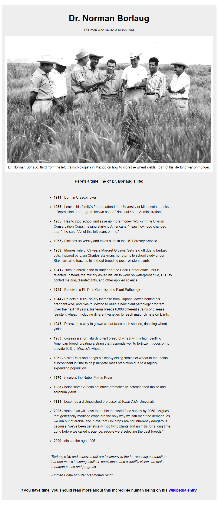

# Kolehiyolo | freeCodeCamp | Build a Tribute Page
Welcome! I am a budding coder and this is my submission to the 'Build a Tribute Page' project from freeCodeCamp.

## Table of contents
- [Overview](#overview)
  - [Summary](#summary)
  - [The Challenge](#the-challenge)
  - [Screenshots](#screenshot)
  - [Links](#links)
- [My Process](#my-process)
  - [Built With](#built-with)
  - [What I Learned](#what-i-learned)
  - [Continued Development](#continued-development)
  - [Useful Resources](#useful-resources)
- [Author](#author)
- [Acknowledgments](#acknowledgments)

## Overview
### Summary
The challenge doesn't really specify whether or not I should deviate from the design, but I chose not to alter anything at all to help polish my design observation skills. I find the content about Dr. Norman Borlaug to be truly fascinating and served as a powerful motivation for me.
### The Challenge
Users should be able to:
- See my submission to the project
- Perfectly mimic the sample page from [CodePen](https://codepen.io/freeCodeCamp/full/zNqgVx)
- Make sure to follow the user stories dictated by freeCodeCamp
- Build it while ensuring accessibility and responsive-ness
### Screenshots

  
  
  

### Links
- freeCodeCamp Challenge: [freeCodeCamp | Build a Tribute Page](https://www.freecodecamp.org/learn/responsive-web-design/responsive-web-design-projects/build-a-tribute-page)
- Sample: [CodePen](https://codepen.io/freeCodeCamp/full/zNqgVx)
- Solution URL: [GitHub Repo](https://github.com/kolehiyolo/freecodecamp--build_a_tribute_page)
- Live Site URL (Static): [Kolehiyolo | freeCodeCamp | Build a Tribute Page (Static)](https://your-live-site-url.com)
- Live Site URL: [Kolehiyolo | freeCodeCamp | Build a Tribute Page](https://kolehiyolo.github.io/freecodecamp--build_a_tribute_page/)

## My Process
### Built With
- HTML5
- CSS5
- SASS
- Mobile-first workflow

### What I Learned
This project is where I really started getting into media-queries. It's been a while since I worked on this, but I remember dabbling with it for a while before really getting the desired results.

I also remember having problem with the responsive-ness of the main image as it wasn't properly adjusting as you reduce the width. This is where I also started using an [eye-dropper extension](https://chrome.google.com/webstore/detail/colorpick-eyedropper/ohcpnigalekghcmgcdcenkpelffpdolg) on Chrome to get all the right colors straight from the sample project.

I did not, at all, look at the code behind the CodePen project and based all the measurements on looks. I also took great care in finding the minute changes during breakpoints.

### Continued Development
Since this project, I've picked up the great habit of using the eyedropper tool for really getting the right colors. I've also become more acquainted to media-queries and how margins work.

### Useful Resources
- [ColorPick Eyedropper](https://chrome.google.com/webstore/detail/colorpick-eyedropper/ohcpnigalekghcmgcdcenkpelffpdolg) - This helped me in getting exactly what colors to use.

## Author
- Website - [Add your name here](https://www.your-site.com)
- Frontend Mentor - [@kolehiyolo | Frontend Mentor](https://www.frontendmentor.io/profile/kolehiyolo)
- LinkedIn - [@Tristan Sean Paul Cinco | LinkedIn](https://www.linkedin.com/in/tristan-sean-paul-cinco-8685061a1/)
- GitHub - [@kolehiyolo | Github](https://github.com/kolehiyolo)
- YouTube - [@Tristan Sean Paul Cinco | YouTube](https://www.youtube.com/channel/UCeQfdvq83XLp-eS4vbZZN8Q)
- Facebook - [@Tristan Sean Paul Cinco | Facebook](https://www.facebook.com/tristanseanpaul.cinco.39/)
- Twitter - [@kolehiyolo1221 | Twitter](https://twitter.com/kolehiyolo1221)
- Instagram - [@kolehiyolo | Instagram](https://www.twitter.com/yourusername)

## Acknowledgments
This is where you can give a hat tip to anyone who helped you out on this project. Perhaps you worked in a team or got some inspiration from someone else's solution. This is the perfect place to give them some credit.